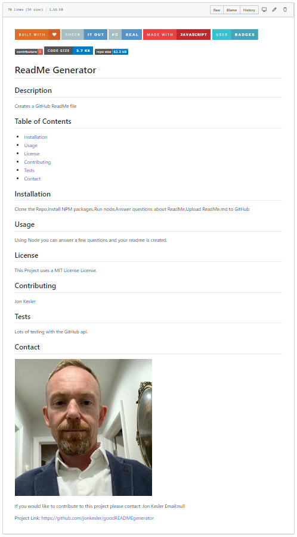
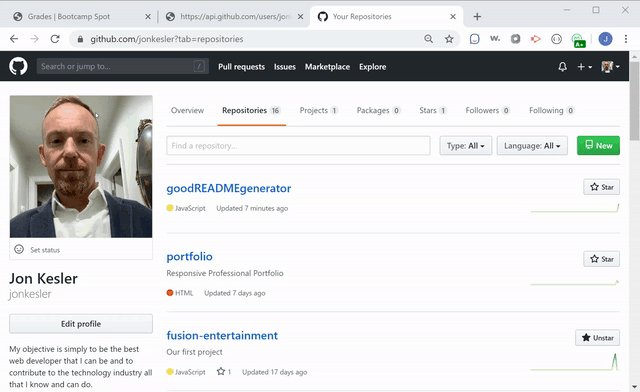
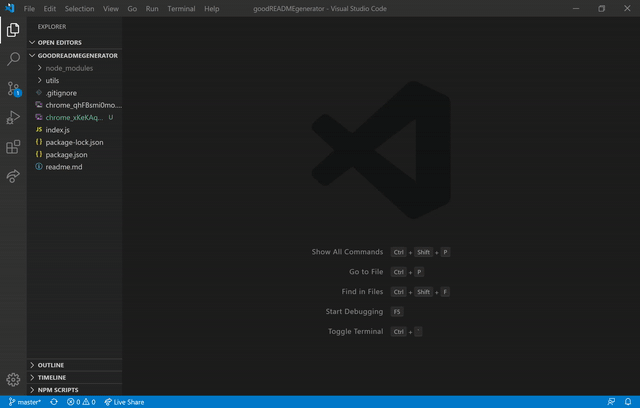

# ReadMe Generator

## Description 
    
Creates a readme file using node.js
    
    
## Table of Contents
    
* [Installation](#installation)
* [Usage](#usage)
* [License](#license)
* [Contributing](#contributing)
* [Tests](#tests)
* [Contact](#contact)
    
    
## Installation
    
Clone the Repo,Install NPM packages,Run node,Answer questions,Upload ReadMe.md to GitHub

      
## Usage 
    
To create a readme file on the fly.

Screen Shot
  

Download from GitHub                      

Install and run with Node.js

## License

This Project uses a MIT License License.

## Contributing
    
Jon Kesler
    
    
## Tests

Lots of testing with the GitHub Api.  It was not to friendly at first.
    

## Contact

If you would like to contribute to this project please contact: 
  Jon Kesler 
  Email:jkesler@hotmail.com   

Web URL: https://github.com/jonkesler/goodREADMEgenerator
Repository URL: https://github.com/jonkesler/goodREADMEgenerator.git
Repository SSH: git@github.com:jonkesler/goodREADMEgenerator.git

